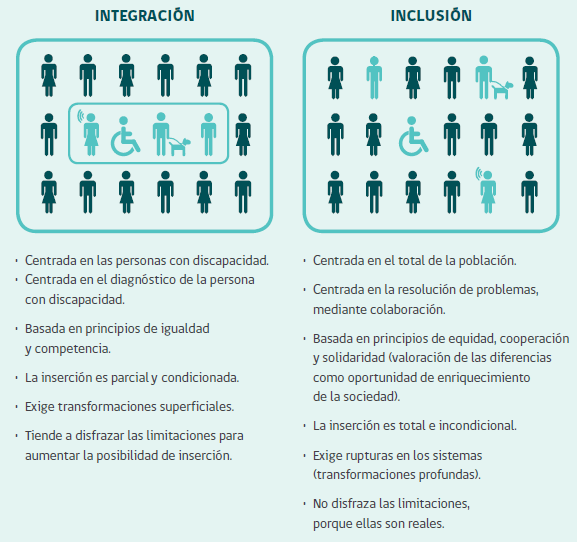

## Ética y Responsabilidad Social
### Personas con Discapacidad en Chile

 

Alan Lisboa - Daniel Pavez

---
### Motivación

@ul

- Falta de inclusión:
  - Movilización.
  - Educación.
  - Laboral.
- Discriminación.
- Inclusión en nuestra universidad.

@ulend

---
### Descripción del problema

@ul

- Enfoque actual centrado en la *integración* y no en la *inclusión*.
- Adaptación de los espacios públicos.
- Universidades y carreras.
- Discriminación laboral.

@ulend

@fa[arrow-down]

+++
### Integración en vez de Inclusión

@fa[arrow-down]

+++
### Espacios públicos

@ul

- Semáforos con sonido.
- Cerámicas de veredas con distintas texturas (detección de puntos importantes por medio de los bastones).
- Información a la comunidad acerca de los perros guía (no deben de distraerlos mientras están trabajando).

@ulend

@fa[arrow-down]

+++
### Universidades y carreras

@ul

- En la actualidad la mayor parte de las universidades chilenas no se encuentran adaptadas para recibir a estudiantes en situación de discapacidad, en especial para los casos de discapacidad sensorial.
- En cuanto a las carreras universitarias, estas también son limitadas para los estudiantes con discapacidad sensorial, siendo posible acceder en la mayoría de los casos, tan sólo a carreras del área de las humanidades.

@ulend

---
