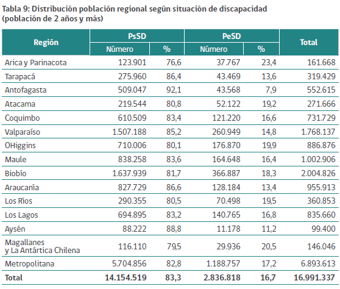
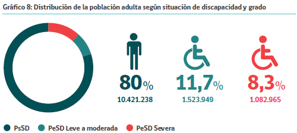
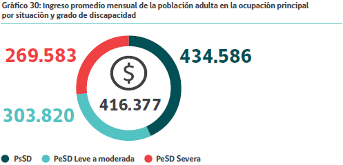

## Ética y Responsabilidad Social
### Personas con Discapacidad en Chile

 

Alan Lisboa - Daniel Pavez

---

## Motivación

---
### Porcentaje de la población con discapacidad

@fa[arrow-down]

+++
### Porcentaje de la población adulta con discapacidad

@fa[arrow-down]

+++

@fa[arrow-down]

+++
### Brecha en educación

---
### Descripción del problema

@ul

- Enfoque actual centrado en la *integración* y no en la *inclusión*.
- Adaptación de los espacios públicos (accesibilidad).
- Universidades y carreras.
- Falta de inclusión laboral.
- Ley 20422.

@ulend

@fa[arrow-down]

+++
### Integración en vez de Inclusión

@fa[arrow-down]

+++
### Accesibilidad urbana

@ul

- Bajadas para sillas de ruedas.
- Semáforos con sonido.
- Cerámicas de veredas con distintas texturas.
- Información a la comunidad acerca de los perros guía.

@ulend

@fa[arrow-down]

+++
### Universidades y carreras

@ul

- Universidades:
  - Falta de material adaptado e instrucción a los profesores.
  - Falta de implementos y accesibilidad.
- Carreras universitarias para estudiantes con discapacidades sensoriales limitadas, enfocadas a las humanidades.

@ulend

@fa[arrow-down]

+++

### Nuestra universidad

@ul

- "La Universidad de Talca ha hecho de la integración de personas con discapacidad un compromiso institucional."
- Vicerrector Sergio Matus afirmó "todos nuestros nuevos edificios disponen de estructuras habilitadas con ese fin y con estacionamientos reservados para personas con discapacidad”.

@ulend

(http://www.utalca.cl/link.cgi//SalaPrensa/RSU/6007)

@fa[arrow-down]

+++
### Nuestro campus

@ul

- Ausencia de alumnos en situación de discapacidad.
- Falta de estructuras habilitadas para este propósito.
- No hay medio especiales de ingreso para personas con algún tipo de discapacidad (necesasario ya que tan sólo la PSU 2017 aceptó a personas en situación de discapacidad).

@ulend

(http://www.elmostrador.cl/agenda-pais/2017/11/24/mas-de-400-estudiantes-con-discapacidad-rendiran-la-psu-con-formatos-accesibles/)

@fa[arrow-down]

+++
### Falta de inclusión laboral

@fa[arrow-down]

+++
### Falta de inclusión laboral

@fa[arrow-down]

+++
### Ley 20422

@ul

- "Artículo 1.- El objeto de esta ley es asegurar el derecho a la igualdad de oportunidades de las personas con discapacidad, con el fin de obtener su plena inclusión social, asegurando el disfrute de sus derechos y eliminando cualquier forma de discriminación fundada en la discapacidad."
- "Artículo 39.- ... Las instituciones de educación superior deberán contar con mecanismos que faciliten el acceso de las personas con discapacidad, así como adaptar los materiales de estudio y medios de enseñanza para que dichas personas puedan cursar las diferentes carreras."

@ulend

@fa[arrow-down]

+++
### Cumplimiento de los plazos

@ul

- "Al *3 de marzo de 2019*, los edificios existentes, de uso público o que presten servicio a la comunidad, deberán efectuar las adecuaciones necesarias que les permitan ser accesibles y utilizables por personas con movilidad reducida en forma autónoma.  A sí mismo, al *año 2018*, los bienes nacionales de uso público, administrados por organismos del Estado o Municipalidades, deberán ser accesibles y utilizables en forma independiente y sin dificultad por personas con discapacidad, en especial, las veredas, pasarelas peatonales, parques y plazas."

@ulend

(http://www.ciudadaccesible.cl/?p=5809)

---
### Entrevistada

@ul

- Nombre: Valentina González
- Institución: Universidad Católica de Temuco
- Función: Estudiante de Psicología y voluntaria de CERETI

@ulend

@fa[arrow-down]

+++
### CERETI

@ul

- Funciona en base a voluntariado.
- Provee de las herramientas necesarias a los estudiantes en situación de discapacidad.
- Asistencia a los estudiantes en su progreso, a través de tutores.
- Difusión de información a los estudiantes de la universidad.

@ulend

@fa[arrow-down]

+++
### Otras medidas tomadas por la UTC

@ul

- Creación de la Dirección General de Inclusión y Acompañamiento Académico (DGIA) en el año 2016.
- Admisión especial para personas en situación de discapacidad.
- Contratación de personal especializado.

@ulend

@fa[arrow-down]

+++
### Problemas persistentes

@ul

- Transporte y accesibilidad urbana.
- Dificultad para proveer material necesario a estudiantes con discapacidades sensoriales.
- Falta de capacitación a los profesores en materia de inclusión.

@ulend

@fa[arrow-down]

---
## Desafío: Inclusión en la UTAL

@fa[arrow-down]

+++

### Necesidades en la UTAL

@ul

- Incrementar la accesibilidad en las construcciones existentes.
- Asegurar la accesibilidad en las construcciones nuevas.
- Implementar medidas de ingreso especial.
- Permitir la inclusión en todas las carreras.
- Crear un centro similar a CERETI de la UTC, con el fin de brindar el apoyo necesario a estudiantes en situación de discapacidad que así lo requieran.
- Contratar personal especializado.

@ulend

---
## Conclusión